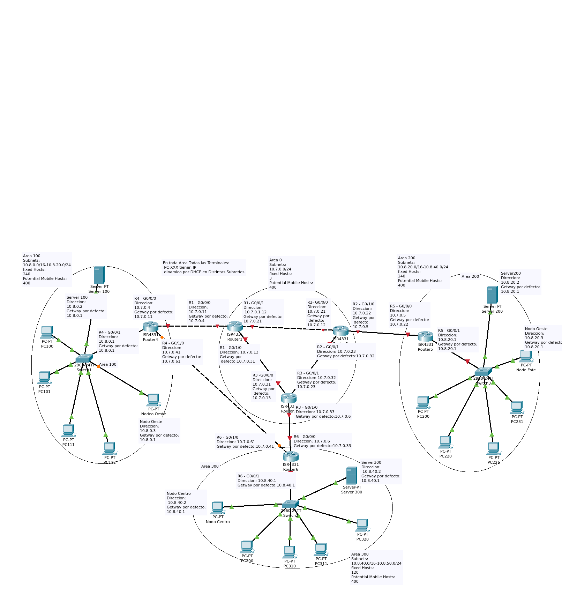

# TP teleprocesos-y-redes_2
*El Archivo tp.pkt se descarga y se abre con packet tracer, es un binario asi que no se va a ver el delta de manera discernible*

*La consigna entera del TP esta en el [Repo](Consigna.docx) *

	
## 1. Definir reemplazo de Router cisco 2961 con OSPf - [X]
	
		La recomendacion en el sitio del vendedor es que vayamos por la serie 4000 de routers asi que elegimos CISCO-4331.
// preguntar sie sta bien
		
	
## 2. Definir distribucion de Redes [X] 
	
			10.7.0.0 y 10.8.0.0 (ambito de direcciones de red)
			50 subredes
			600 estaciones fijas
			400 estaciones moviles [estaciones de trabajo que un dia estan y otro no, pueden ser notebooks celus, etc)
		
## 3.  mascaras, etc. [X] 

		
- Las estaciones fijas pueden estar en cualquier lado
    + asi que calculamos:
        * 600 estaciones fijas / 50 subredes = 12 estaciones fijas por subred  
        
        * 12 estaciones fijas por subred + 400 que pueden estar en cualquier parte de la Organizacion
        
        * Si asumimos que la todas las maquinas mobiles pueden estar en cualquier lugar de la red. minimo 412 por subred con un CIDR/23 hay 512 hosts(510 usables), lo cual es suficiente para permitir el creciemeinto a futuro de la organizacion y soportar maquinas mobiles.   
        
        *  /23 permite crear mas subredes a fututo
                		
        * Incluye los servers y nodos.
		
        * esas estaciones son el total de la organizaion, y solo una subred pedude acceder al nodo central
		
        * Dejamos la primera subred de 10.7.0.0/23 para el backhoul como convencion y futuras direcciones.

## 4. Asignacion de subredes[X]
   * Area 0:
			10.7.0.0/23- 10.7.12.0/23
   * Area 100:
			10.8.0.0/23 - 10.8.34.0/23
   * Area 200:
			10.8.36.0/23 - 10.8.68.0/23
   * Area 300:
			10.8.70.0/23 - 10.8.100.0/23
			
			
## 5. asignar datos al diagrama en el emulador [-]

- Crear routers, switches, servers y terminales [X]
- Como solo va haber limitadas maquinas documentadas en que area y conectada a donde van a  estar las estaciones de cada subred (conexiones, areas, etc)[X]
- Decidir, Todas VLANS o agrear mas routers y una subred por interfaz? [X] VLANS
- Discutir,Agegar routers wireless para estacioens mobiles? [X] NO
- Connectar y dar Ip routers [X] 
- Connectar y crear areas OSPF  [-] 
    - // probar:   >show ip ospf interface;  >   
    - R1 A0
		> en
		> conf t
		> router ospf id
		> network 10.7.0.0  255.255.254.0  area 0
		> network 10.7.2.0  255.255.254.0  area 0
		> network 10.7.6.0  255.255.254.0  area 0
		> end

    - R2 A0
		> en
		> conf t
		> router ospf id
		> network 10.7.0.0  255.255.254.0  area 0
		> network 10.7.4.0  255.255.254.0  area 0
		> network 10.7.10.0  255.255.254.0  area 0
		> end

    - R3 A0
		> en
		> conf t
		> router ospf id
		> network 10.7.6.0  255.255.254.0  area 0
		> network 10.7.4.0  255.255.254.0  area 0
		> network 10.7.12.0  255.255.254.0  area 0 
		> end

    - R4 A0 a100
		> en
		> conf t
		> router ospf id
		> network 10.7.2.0  255.255.254.0  area 0
		> network 10.7.8.0  255.255.254.0  area 0
		> network 10.8.0.0  255.255.254.0  area 100 // va todo el rango?
		> end

    - R5 A0 a100
		> en
		> conf t
		> router ospf id
		> network 10.7.10.0  255.255.254.0  area 0
		> network 10.8.36.0  255.255.254.0  area 200 // va todo el rango?
		> end

    - R6 A0 a100
		> en
		> conf t
		> router ospf id
		> network 10.7.12.0  255.255.254.0  area 0
		> network 10.7.8.0  255.255.254.0  area 0
		> network 10.8.70.0  255.255.254.0  area 300 // va todo el rango?
		> end
    
- Coenctar y dar ip fija a servers [] 
- Coenctar y dar ip fija a Nodos [] 
- Dar IP a terminales por  [] 
- Armar subredes por VLANS (las 50)[] 

	
## 6. Agregar ACL del TP []   
- La estación de trabajo PC100 y el servidor de archivos Server100 se encuentran en la subred de administración. Cualquier dispositivo en la subred de administración debe tener acceso a cualquier otro dispositivo en cualquier parte de la red. []  

- Las estaciones de trabajo en las subredes del área 200 y 300 no deben tener acceso a ningún dispositivo fuera de su subred, salvo para interconectarse con el servidor de archivos Server100.- Cada router debe poder hacer telnet en los demás routers y tener acceso a cualquier dispositivo en la red. []

- Se solicita escriba un corto resumen del propósito de cada control de acceso, las interfaces en las que se utilizarán y la dirección del tráfico. []

	
	
## 7. Instalar y configurar TFTF en los servers como dice el TP [] 

## 8. Hacer pruebas []   
  
- Hacer telnet entre ruters de diferentes áreas 	CON ÉXITO  [] 
- Hacer telnet de PC300 al router del área 200  	BLOQUEADO  [] 
- Hacer telnet de PC200 al router del área 300 	BLOQUEADO [] 
- Hacer telnet de PC100 y Nodo Oeste a los routers del área 200 y 300 	CON ÉXITO [] 
- Hacer telnet del Server100 a todos los routers	CON ÉXITO 
- Hacer ping de PC200, Nodo Centro, PC300 y Nodo Este al servidor de arch 100 	CON ÉXITO [] 
- Hacer ping de PC200 a Nodo Centro	BLOQUEADO  [] 
- Hacer ping de PC300 a Nodo Este	BLOQUEADO  [] 
- Hacer ping de PC200 a Nodo Este	CON EXITO [] 
- Hacer ping de PC300 a Nodo Centro	CON EXITO  [] 
- Hacer ping de PC100 a PC200, Nodo Centro, PC300 y Nodo Este	CON ÉXITO  [] 
- Hacer ping del router del área 200 a PC300, Nodo Este y Server300	CON ÉXITO  [] 
- Hacer ping del router del área 300 a PC200, Nodo Centro y Server200	CON ÉXITO  [] 

	
## 9.  Hacer docuemntacion final mencionada en el TP[]

# Biblio
	
	
	- Cisco EoS doc
		https://www.cisco.com/c/en/us/products/collateral/routers/2900-series-integrated-services-routers-isr/eos-eol-notice-c51-737831.html
		Ahi recomiendan usar la serie 4000 de ISR
		-recomendaicon de reemplzao
			https://www.cisco.com/c/en/us/products/routers/4000-series-integrated-services-routers-isr/index.html
		- comparacion de serie 4000
			https://www.cisco.com/c/en_in/products/routers/4000-series-integrated-services-routers-isr/models-comparison.html

# Imagen primera revision de topologia

