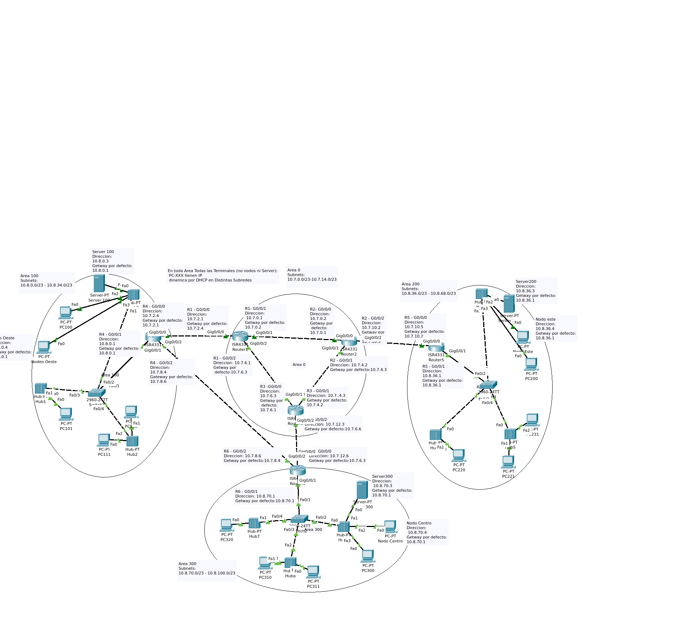

# TP teleprocesos-y-redes_2
*El Archivo tp.pkt se descarga y se abre con packet tracer, es un binario asi que no se va a ver el delta de manera discernible*

*La consigna entera del TP esta en el [Repo](Consigna.docx) *

	
## 1. Definir reemplazo de Router cisco 2961 con OSPf - [X]
	
		La recomendacion en el sitio del vendedor es que vayamos por la serie 4000 de routers asi que elegimos CISCO-4331.
// preguntar sie sta bien
		
	
## 2. Definir distribucion de Redes [X] 
	
			10.7.0.0 y 10.8.0.0 (ambito de direcciones de red)
			50 subredes
			600 estaciones fijas
			400 estaciones moviles [estaciones de trabajo que un dia estan y otro no, pueden ser notebooks celus, etc)
		
## 3.  mascaras, etc. [X] 


		
- Las estaciones fijas pueden estar en cualquier lado
    + asi que calculamos:
        * 600 estaciones fijas / 50 subredes = 12 estaciones fijas por subred  
        
        * 12 estaciones fijas por subred + 400 que pueden estar en cualquier parte de la Organizacion
        
        * Si asumimos que la todas las maquinas mobiles pueden estar en cualquier lugar de la red. minimo 412 por subred con un CIDR/23 hay 512 hosts(510 usables), lo cual es suficiente para permitir el creciemeinto a futuro de la organizacion y soportar maquinas mobiles.   
        
        *  /23 permite crear mas subredes a fututo
                		
        * Incluye los servers y nodos.
		
        * esas estaciones son el total de la organizaion, y solo una subred pedude acceder al nodo central
		
        * Dejamos la primera subred de 10.7.0.0/23 para el backhoul como convencion y futuras direcciones.


## 4. Asignacion de subredes[X]
   * Area 0:
			10.7.0.0/23- 10.7.12.0/23
   * Area 100:
			10.8.0.0/23 - 10.8.34.0/23
   * Area 200:
			10.8.36.0/23 - 10.8.68.0/23
   * Area 300:
			10.8.70.0/23 - 10.8.100.0/23
			
			
## 5. asignar datos al diagrama en el emulador [X]

- Crear routers, switches, servers y terminales [X]
- Como solo va haber limitadas maquinas documentadas en que area y conectada a donde van a  estar las estaciones de cada subred (conexiones, areas, etc)[X]
- Decidir, Todas VLANS o agrear mas routers y una subred por interfaz? [X] VLANS
- Discutir,Agegar routers wireless para estacioens mobiles? [X] NO
- Connectar y dar Ip routers [X] 
- Connectar y crear areas OSPF  [X]
    - // probar:   >show ip ospf interface;  >   
  	- R1 A0
```
                en
                conf t
                router ospf id
                network 10.7.0.0  255.255.254.0	area 0
                network 10.7.2.0  255.255.254.0	area 0
                network 10.7.6.0  255.255.254.0	area 0
                end
```
 
    - R2 A0
```
                en
                conf t
                router ospf id
                network 10.7.0.0  255.255.254.0  area 0
                network 10.7.4.0  255.255.254.0  area 0
                network 10.7.10.0  255.255.254.0  area 0
                end
```
	- R3 A0
```
		 en
		 conf t
		 router ospf id
		 network 10.7.6.0  255.255.254.0  area 0
		 network 10.7.4.0  255.255.254.0  area 0
		 network 10.7.12.0  255.255.254.0  area 0
```
		 end
	- R4 A0 A100
```
		 en
		 conf t
		 router ospf 1
		 network 10.7.2.0  255.255.254.0  area 0
		 network 10.7.8.0  255.255.254.0  area 0
			network 10.8.0.0 255.255.254.0   area 100 
			network 10.8.2.0 255.255.254.0   area 100 
			network 10.8.4.0 255.255.254.0   area 100 
			network 10.8.6.0 255.255.254.0   area 100 
			network 10.8.8.0 255.255.254.0   area 100 
			network 10.8.10.0 255.255.254.0   area 100 
			network 10.8.12.0 255.255.254.0   area 100 
			network 10.8.14.0 255.255.254.0   area 100 
			network 10.8.16.0 255.255.254.0   area 100 
			network 10.8.18.0 255.255.254.0   area 100 
			network 10.8.20.0 255.255.254.0   area 100 
			network 10.8.22.0 255.255.254.0   area 100 
			network 10.8.24.0 255.255.254.0   area 100 
			network 10.8.26.0 255.255.254.0   area 100 
			network 10.8.28.0 255.255.254.0   area 100 
			network 10.8.30.0 255.255.254.0   area 100 
			network 10.8.32.0 255.255.254.0   area 100 
			network 10.8.34.0 255.255.254.0   area 100 

		 end
```
	- R5 A200
```
		 en
		 conf t
		 router ospf 1
		 network 10.7.10.0  255.255.254.0  area 0
			network 10.8.36.0 255.255.254.0   area 200 
			network 10.8.38.0 255.255.254.0   area 200 
			network 10.8.40.0 255.255.254.0   area 200 
			network 10.8.42.0 255.255.254.0   area 200 
			network 10.8.44.0 255.255.254.0   area 200 
			network 10.8.46.0 255.255.254.0   area 200 
			network 10.8.48.0 255.255.254.0   area 200 
			network 10.8.50.0 255.255.254.0   area 200 
			network 10.8.52.0 255.255.254.0   area 200 
			network 10.8.54.0 255.255.254.0   area 200 
			network 10.8.56.0 255.255.254.0   area 200 
			network 10.8.58.0 255.255.254.0   area 200 
			network 10.8.60.0 255.255.254.0   area 200 
			network 10.8.62.0 255.255.254.0   area 200 
			network 10.8.64.0 255.255.254.0   area 200 
			network 10.8.66.0 255.255.254.0   area 200 
			network 10.8.68.0 255.255.254.0   area 200 
		 end
```
    - R6 A300
```
		 en
		 conf t
		 router ospf 1
		 network 10.7.12.0  255.255.254.0  area 0
		 network 10.7.8.0  255.255.254.0  area 0
			network 10.8.70.0 255.255.254.0   area 300 
			network 10.8.72.0 255.255.254.0   area 300 
			network 10.8.74.0 255.255.254.0   area 300 
			network 10.8.76.0 255.255.254.0   area 300 
			network 10.8.78.0 255.255.254.0   area 300 
			network 10.8.80.0 255.255.254.0   area 300 
			network 10.8.82.0 255.255.254.0   area 300 
			network 10.8.84.0 255.255.254.0   area 300 
			network 10.8.86.0 255.255.254.0   area 300 
			network 10.8.88.0 255.255.254.0   area 300 
			network 10.8.90.0 255.255.254.0   area 300 
			network 10.8.92.0 255.255.254.0   area 300 
			network 10.8.94.0 255.255.254.0   area 300 
			network 10.8.96.0 255.255.254.0   area 300 
			network 10.8.98.0 255.255.254.0   area 300 
			network 10.8.100.0 255.255.254.0   area 300 
		 end
```
- Armar subredes por VLANS (las 50)[X]
    -> probar con show int; show vlan
    - Area 100
        - R4 # 
```
		en 
			conf t 
			
			int G0/0/1.100
			encapsulation dot1q  100
			ip address 10.8.0.1 255.255.254.0
			no shut

			int G0/0/1.102
			encapsulation dot1q  102
			ip address 10.8.2.1 255.255.254.0
			no shut

			int G0/0/1.104
			encapsulation dot1q  104
			ip address 10.8.4.1 255.255.254.0
			no shut

			int G0/0/1.106
			encapsulation dot1q  106
			ip address 10.8.6.1 255.255.254.0
			no shut

			int G0/0/1.108
			encapsulation dot1q  108
			ip address 10.8.8.1 255.255.254.0
			no shut

			int G0/0/1.110
			encapsulation dot1q  110
			ip address 10.8.10.1 255.255.254.0
			no shut

			int G0/0/1.112
			encapsulation dot1q  112
			ip address 10.8.12.1 255.255.254.0
			no shut

			int G0/0/1.114
			encapsulation dot1q  114
			ip address 10.8.14.1 255.255.254.0
			no shut

			int G0/0/1.116
			encapsulation dot1q  116
			ip address 10.8.16.1 255.255.254.0
			no shut

			int G0/0/1.118
			encapsulation dot1q  118
			ip address 10.8.18.1 255.255.254.0
			no shut

			int G0/0/1.120
			encapsulation dot1q  120
			ip address 10.8.20.1 255.255.254.0
			no shut

			int G0/0/1.122
			encapsulation dot1q  122
			ip address 10.8.22.1 255.255.254.0
			no shut

			int G0/0/1.124
			encapsulation dot1q  124
			ip address 10.8.24.1 255.255.254.0
			no shut

			int G0/0/1.126
			encapsulation dot1q  126
			ip address 10.8.26.1 255.255.254.0
			no shut

			int G0/0/1.128
			encapsulation dot1q  128
			ip address 10.8.28.1 255.255.254.0
			no shut

			int G0/0/1.130
			encapsulation dot1q  130
			ip address 10.8.30.1 255.255.254.0
			no shut

			int G0/0/1.132
			encapsulation dot1q  132
			ip address 10.8.32.1 255.255.254.0
			no shut

			int G0/0/1.134
			encapsulation dot1q  134
			ip address 10.8.34.1 255.255.254.0
			no shut

			end
```
        - SW1
```
			en 
			conf t
			vlan 100
			int vlan 100
			ip address 10.8.0.2 255.255.254.0
			int fa0/2
			switchport mode access
			switchport access vlan 100
			no shut

			vlan 102
			int vlan 102
			ip address 10.8.2.2 255.255.254.0
			int fa0/3
			switchport mode access
			switchport access vlan 102
			no shut

			vlan 104
			int vlan 104
			ip address 10.8.4.2 255.255.254.0
			int fa0/4
			switchport mode access
			switchport access vlan 104
			no shut

			vlan 106
			int vlan 106
			ip address 10.8.6.2 255.255.254.0
			int fa0/5
			switchport mode access
			switchport access vlan 106
			no shut

			vlan 108
			int vlan 108
			ip address 10.8.8.2 255.255.254.0
			int fa0/6
			switchport mode access
			switchport access vlan 108
			no shut

			vlan 110
			int vlan 110
			ip address 10.8.10.2 255.255.254.0
			int fa0/7
			switchport mode access
			switchport access vlan 110
			no shut

			vlan 112
			int vlan 112
			ip address 10.8.12.2 255.255.254.0
			int fa0/8
			switchport mode access
			switchport access vlan 112
			no shut

			vlan 114
			int vlan 114
			ip address 10.8.14.2 255.255.254.0
			int fa0/9
			switchport mode access
			switchport access vlan 114
			no shut

			vlan 116
			int vlan 116
			ip address 10.8.16.2 255.255.254.0
			int fa0/10
			switchport mode access
			switchport access vlan 116
			no shut

			vlan 118
			int vlan 118
			ip address 10.8.18.2 255.255.254.0
			int fa0/11
			switchport mode access
			switchport access vlan 118
			no shut

			vlan 120
			int vlan 120
			ip address 10.8.20.2 255.255.254.0
			int fa0/12
			switchport mode access
			switchport access vlan 120
			no shut

			vlan 122
			int vlan 122
			ip address 10.8.22.2 255.255.254.0
			int fa0/13
			switchport mode access
			switchport access vlan 122
			no shut

			vlan 124
			int vlan 124
			ip address 10.8.24.2 255.255.254.0
			int fa0/14
			switchport mode access
			switchport access vlan 124
			no shut

			vlan 126
			int vlan 126
			ip address 10.8.26.2 255.255.254.0
			int fa0/15
			switchport mode access
			switchport access vlan 126
			no shut

			vlan 128
			int vlan 128
			ip address 10.8.28.2 255.255.254.0
			int fa0/16
			switchport mode access
			switchport access vlan 128
			no shut

			vlan 130
			int vlan 130
			ip address 10.8.30.2 255.255.254.0
			int fa0/17
			switchport mode access
			switchport access vlan 130
			no shut

			vlan 132
			int vlan 132
			ip address 10.8.32.2 255.255.254.0
			int fa0/18
			switchport mode access
			switchport access vlan 132
			no shut

			vlan 134
			int vlan 134
			ip address 10.8.34.2 255.255.254.0
			int fa0/19
			switchport mode access
			switchport access vlan 134
			no shut

			
			int fa0/1
			switchport mode trunk
			no shut
			
			end
```


		
    - Area 300
        - R6
```
			en 
			conf t
			int G0/0/1.370
			encapsulation dot1q  370
			ip address 10.8.70.1 255.255.254.0
			no shut

			int G0/0/1.372
			encapsulation dot1q  372
			ip address 10.8.72.1 255.255.254.0
			no shut

			int G0/0/1.374
			encapsulation dot1q  374
			ip address 10.8.74.1 255.255.254.0
			no shut

			int G0/0/1.376
			encapsulation dot1q  376
			ip address 10.8.76.1 255.255.254.0
			no shut

			int G0/0/1.378
			encapsulation dot1q  378
			ip address 10.8.78.1 255.255.254.0
			no shut

			int G0/0/1.380
			encapsulation dot1q  380
			ip address 10.8.80.1 255.255.254.0
			no shut

			int G0/0/1.382
			encapsulation dot1q  382
			ip address 10.8.82.1 255.255.254.0
			no shut

			int G0/0/1.384
			encapsulation dot1q  384
			ip address 10.8.84.1 255.255.254.0
			no shut

			int G0/0/1.386
			encapsulation dot1q  386
			ip address 10.8.86.1 255.255.254.0
			no shut

			int G0/0/1.388
			encapsulation dot1q  388
			ip address 10.8.88.1 255.255.254.0
			no shut

			int G0/0/1.390
			encapsulation dot1q  390
			ip address 10.8.90.1 255.255.254.0
			no shut

			int G0/0/1.392
			encapsulation dot1q  392
			ip address 10.8.92.1 255.255.254.0
			no shut

			int G0/0/1.394
			encapsulation dot1q  394
			ip address 10.8.94.1 255.255.254.0
			no shut

			int G0/0/1.396
			encapsulation dot1q  396
			ip address 10.8.96.1 255.255.254.0
			no shut

			int G0/0/1.398
			encapsulation dot1q  398
			ip address 10.8.98.1 255.255.254.0
			no shut

			int G0/0/1.400
			encapsulation dot1q  400
			ip address 10.8.100.1 255.255.254.0
			no shut
			
			end
```			
        - SW2
```
			en 
			conf t
			
			vlan 370
			int vlan 370
			ip address 10.8.70.2 255.255.254.0
			int fa0/2
			switchport mode access
			switchport access vlan 370
			no shut

			vlan 372
			int vlan 372
			ip address 10.8.72.2 255.255.254.0
			int fa0/3
			switchport mode access
			switchport access vlan 372
			no shut

			vlan 374
			int vlan 374
			ip address 10.8.74.2 255.255.254.0
			int fa0/4
			switchport mode access
			switchport access vlan 374
			no shut

			vlan 376
			int vlan 376
			ip address 10.8.76.2 255.255.254.0
			int fa0/5
			switchport mode access
			switchport access vlan 376
			no shut

			vlan 378
			int vlan 378
			ip address 10.8.78.2 255.255.254.0
			int fa0/6
			switchport mode access
			switchport access vlan 378
			no shut

			vlan 380
			int vlan 380
			ip address 10.8.80.2 255.255.254.0
			int fa0/7
			switchport mode access
			switchport access vlan 380
			no shut

			vlan 382
			int vlan 382
			ip address 10.8.82.2 255.255.254.0
			int fa0/8
			switchport mode access
			switchport access vlan 382
			no shut

			vlan 384
			int vlan 384
			ip address 10.8.84.2 255.255.254.0
			int fa0/9
			switchport mode access
			switchport access vlan 384
			no shut

			vlan 386
			int vlan 386
			ip address 10.8.86.2 255.255.254.0
			int fa0/10
			switchport mode access
			switchport access vlan 386
			no shut

			vlan 388
			int vlan 388
			ip address 10.8.88.2 255.255.254.0
			int fa0/11
			switchport mode access
			switchport access vlan 388
			no shut

			vlan 390
			int vlan 390
			ip address 10.8.90.2 255.255.254.0
			int fa0/12
			switchport mode access
			switchport access vlan 390
			no shut

			vlan 392
			int vlan 392
			ip address 10.8.92.2 255.255.254.0
			int fa0/13
			switchport mode access
			switchport access vlan 392
			no shut

			vlan 394
			int vlan 394
			ip address 10.8.94.2 255.255.254.0
			int fa0/14
			switchport mode access
			switchport access vlan 394
			no shut

			vlan 396
			int vlan 396
			ip address 10.8.96.2 255.255.254.0
			int fa0/15
			switchport mode access
			switchport access vlan 396
			no shut

			vlan 398
			int vlan 398
			ip address 10.8.98.2 255.255.254.0
			int fa0/16
			switchport mode access
			switchport access vlan 398
			no shut

			vlan 400
			int vlan 400
			ip address 10.8.100.2 255.255.254.0
			int fa0/17
			switchport mode access
			switchport access vlan 400
			no shut

		
			int fa0/1
			switchport mode trunk
			no shut
			
			end
```
    - Area 200
        - R5
```
			en 
			conf t

			int G0/0/1.236
			encapsulation dot1q  236
			ip address 10.8.36.1 255.255.254.0
			no shut

			int G0/0/1.238
			encapsulation dot1q  238
			ip address 10.8.38.1 255.255.254.0
			no shut

			int G0/0/1.240
			encapsulation dot1q  240
			ip address 10.8.40.1 255.255.254.0
			no shut

			int G0/0/1.242
			encapsulation dot1q  242
			ip address 10.8.42.1 255.255.254.0
			no shut

			int G0/0/1.244
			encapsulation dot1q  244
			ip address 10.8.44.1 255.255.254.0
			no shut

			int G0/0/1.246
			encapsulation dot1q  246
			ip address 10.8.46.1 255.255.254.0
			no shut

			int G0/0/1.248
			encapsulation dot1q  248
			ip address 10.8.48.1 255.255.254.0
			no shut

			int G0/0/1.250
			encapsulation dot1q  250
			ip address 10.8.50.1 255.255.254.0
			no shut

			int G0/0/1.252
			encapsulation dot1q  252
			ip address 10.8.52.1 255.255.254.0
			no shut

			int G0/0/1.254
			encapsulation dot1q  254
			ip address 10.8.54.1 255.255.254.0
			no shut

			int G0/0/1.256
			encapsulation dot1q  256
			ip address 10.8.56.1 255.255.254.0
			no shut

			int G0/0/1.258
			encapsulation dot1q  258
			ip address 10.8.58.1 255.255.254.0
			no shut

			int G0/0/1.260
			encapsulation dot1q  260
			ip address 10.8.60.1 255.255.254.0
			no shut

			int G0/0/1.262
			encapsulation dot1q  262
			ip address 10.8.62.1 255.255.254.0
			no shut

			int G0/0/1.264
			encapsulation dot1q  264
			ip address 10.8.64.1 255.255.254.0
			no shut

			int G0/0/1.266
			encapsulation dot1q  266
			ip address 10.8.66.1 255.255.254.0
			no shut

			int G0/0/1.268
			encapsulation dot1q  268
			ip address 10.8.68.1 255.255.254.0
			no shut

			
			end
```
        - SW3
```
			en 
			conf t

			vlan 236
			int vlan 236
			ip address 10.8.36.2 255.255.254.0
			int fa0/2
			switchport mode access
			switchport access vlan 236
			no shut

			vlan 238
			int vlan 238
			ip address 10.8.38.2 255.255.254.0
			int fa0/3
			switchport mode access
			switchport access vlan 238
			no shut

			vlan 240
			int vlan 240
			ip address 10.8.40.2 255.255.254.0
			int fa0/4
			switchport mode access
			switchport access vlan 240
			no shut

			vlan 242
			int vlan 242
			ip address 10.8.42.2 255.255.254.0
			int fa0/5
			switchport mode access
			switchport access vlan 242
			no shut

			vlan 244
			int vlan 244
			ip address 10.8.44.2 255.255.254.0
			int fa0/6
			switchport mode access
			switchport access vlan 244
			no shut

			vlan 246
			int vlan 246
			ip address 10.8.46.2 255.255.254.0
			int fa0/7
			switchport mode access
			switchport access vlan 246
			no shut

			vlan 248
			int vlan 248
			ip address 10.8.48.2 255.255.254.0
			int fa0/8
			switchport mode access
			switchport access vlan 248
			no shut

			vlan 250
			int vlan 250
			ip address 10.8.50.2 255.255.254.0
			int fa0/9
			switchport mode access
			switchport access vlan 250
			no shut

			vlan 252
			int vlan 252
			ip address 10.8.52.2 255.255.254.0
			int fa0/10
			switchport mode access
			switchport access vlan 252
			no shut

			vlan 254
			int vlan 254
			ip address 10.8.54.2 255.255.254.0
			int fa0/11
			switchport mode access
			switchport access vlan 254
			no shut

			vlan 256
			int vlan 256
			ip address 10.8.56.2 255.255.254.0
			int fa0/12
			switchport mode access
			switchport access vlan 256
			no shut

			vlan 258
			int vlan 258
			ip address 10.8.58.2 255.255.254.0
			int fa0/13
			switchport mode access
			switchport access vlan 258
			no shut

			vlan 260
			int vlan 260
			ip address 10.8.60.2 255.255.254.0
			int fa0/14
			switchport mode access
			switchport access vlan 260
			no shut

			vlan 262
			int vlan 262
			ip address 10.8.62.2 255.255.254.0
			int fa0/15
			switchport mode access
			switchport access vlan 262
			no shut

			vlan 264
			int vlan 264
			ip address 10.8.64.2 255.255.254.0
			int fa0/16
			switchport mode access
			switchport access vlan 264
			no shut

			vlan 266
			int vlan 266
			ip address 10.8.66.2 255.255.254.0
			int fa0/17
			switchport mode access
			switchport access vlan 266
			no shut

			vlan 268
			int vlan 268
			ip address 10.8.68.2 255.255.254.0
			int fa0/18
			switchport mode access
			switchport access vlan 268
			no shut
		
			int fa0/1
			switchport mode trunk
			no shut
			
			end
```

- dar ip por dchp a temrinales (lso fijos configurados a mano" [X]

    -Area 100 
        - R4
```		
			en
			conf t
			
			int vlan 100
			ip dhcp excluded-address 10.8.0.0 10.8.0.4
			ip dhcp pool d-vlan100
			network 10.8.0.0 255.255.254.0
			default-router 10.8.0.1

			int vlan 102
			ip dhcp excluded-address 10.8.2.0 10.8.2.4
			ip dhcp pool d-vlan102
			network 10.8.2.0 255.255.254.0
			default-router 10.8.2.1

			int vlan 104
			ip dhcp excluded-address 10.8.4.0 10.8.4.4
			ip dhcp pool d-vlan104
			network 10.8.4.0 255.255.254.0
			default-router 10.8.4.1

			int vlan 106
			ip dhcp excluded-address 10.8.6.0 10.8.6.4
			ip dhcp pool d-vlan106
			network 10.8.6.0 255.255.254.0
			default-router 10.8.6.1

			int vlan 108
			ip dhcp excluded-address 10.8.8.0 10.8.8.4
			ip dhcp pool d-vlan108
			network 10.8.8.0 255.255.254.0
			default-router 10.8.8.1

			int vlan 110
			ip dhcp excluded-address 10.8.10.0 10.8.10.4
			ip dhcp pool d-vlan110
			network 10.8.10.0 255.255.254.0
			default-router 10.8.10.1

			int vlan 112
			ip dhcp excluded-address 10.8.12.0 10.8.12.4
			ip dhcp pool d-vlan112
			network 10.8.12.0 255.255.254.0
			default-router 10.8.12.1

			int vlan 114
			ip dhcp excluded-address 10.8.14.0 10.8.14.4
			ip dhcp pool d-vlan114
			network 10.8.14.0 255.255.254.0
			default-router 10.8.14.1

			int vlan 116
			ip dhcp excluded-address 10.8.16.0 10.8.16.4
			ip dhcp pool d-vlan116
			network 10.8.16.0 255.255.254.0
			default-router 10.8.16.1

			int vlan 118
			ip dhcp excluded-address 10.8.18.0 10.8.18.4
			ip dhcp pool d-vlan118
			network 10.8.18.0 255.255.254.0
			default-router 10.8.18.1

			int vlan 120
			ip dhcp excluded-address 10.8.20.0 10.8.20.4
			ip dhcp pool d-vlan120
			network 10.8.20.0 255.255.254.0
			default-router 10.8.20.1

			int vlan 122
			ip dhcp excluded-address 10.8.22.0 10.8.22.4
			ip dhcp pool d-vlan122
			network 10.8.22.0 255.255.254.0
			default-router 10.8.22.1

			int vlan 124
			ip dhcp excluded-address 10.8.24.0 10.8.24.4
			ip dhcp pool d-vlan124
			network 10.8.24.0 255.255.254.0
			default-router 10.8.24.1

			int vlan 126
			ip dhcp excluded-address 10.8.26.0 10.8.26.4
			ip dhcp pool d-vlan126
			network 10.8.26.0 255.255.254.0
			default-router 10.8.26.1

			int vlan 128
			ip dhcp excluded-address 10.8.28.0 10.8.28.4
			ip dhcp pool d-vlan128
			network 10.8.28.0 255.255.254.0
			default-router 10.8.28.1

			int vlan 130
			ip dhcp excluded-address 10.8.30.0 10.8.30.4
			ip dhcp pool d-vlan130
			network 10.8.30.0 255.255.254.0
			default-router 10.8.30.1

			int vlan 132
			ip dhcp excluded-address 10.8.32.0 10.8.32.4
			ip dhcp pool d-vlan132
			network 10.8.32.0 255.255.254.0
			default-router 10.8.32.1

			int vlan 134
			ip dhcp excluded-address 10.8.34.0 10.8.34.4
			ip dhcp pool d-vlan134
			network 10.8.34.0 255.255.254.0
			default-router 10.8.34.1


			end 
```

    - Area 200
        -R5
```
			en
			conf t
			
			int vlan 236
			ip dhcp excluded-address 10.8.36.0 10.8.36.4
			ip dhcp pool d-vlan200
			network 10.8.36.0 255.255.254.0
			default-router 10.8.36.1

			int vlan 238
			ip dhcp excluded-address 10.8.38.0 10.8.38.4
			ip dhcp pool d-vlan202
			network 10.8.38.0 255.255.254.0
			default-router 10.8.38.1

			int vlan 240
			ip dhcp excluded-address 10.8.40.0 10.8.40.4
			ip dhcp pool d-vlan204
			network 10.8.40.0 255.255.254.0
			default-router 10.8.40.1

			int vlan 242
			ip dhcp excluded-address 10.8.42.0 10.8.42.4
			ip dhcp pool d-vlan206
			network 10.8.42.0 255.255.254.0
			default-router 10.8.42.1

			int vlan 244
			ip dhcp excluded-address 10.8.44.0 10.8.44.4
			ip dhcp pool d-vlan208
			network 10.8.44.0 255.255.254.0
			default-router 10.8.44.1

			int vlan 246
			ip dhcp excluded-address 10.8.46.0 10.8.46.4
			ip dhcp pool d-vlan210
			network 10.8.46.0 255.255.254.0
			default-router 10.8.46.1

			int vlan 248
			ip dhcp excluded-address 10.8.48.0 10.8.48.4
			ip dhcp pool d-vlan212
			network 10.8.48.0 255.255.254.0
			default-router 10.8.48.1

			int vlan 250
			ip dhcp excluded-address 10.8.50.0 10.8.50.4
			ip dhcp pool d-vlan214
			network 10.8.50.0 255.255.254.0
			default-router 10.8.50.1

			int vlan 252
			ip dhcp excluded-address 10.8.52.0 10.8.52.4
			ip dhcp pool d-vlan216
			network 10.8.52.0 255.255.254.0
			default-router 10.8.52.1

			int vlan 254
			ip dhcp excluded-address 10.8.54.0 10.8.54.4
			ip dhcp pool d-vlan218
			network 10.8.54.0 255.255.254.0
			default-router 10.8.54.1

			int vlan 256
			ip dhcp excluded-address 10.8.56.0 10.8.56.4
			ip dhcp pool d-vlan220
			network 10.8.56.0 255.255.254.0
			default-router 10.8.56.1

			int vlan 258
			ip dhcp excluded-address 10.8.58.0 10.8.58.4
			ip dhcp pool d-vlan222
			network 10.8.58.0 255.255.254.0
			default-router 10.8.58.1

			int vlan 260
			ip dhcp excluded-address 10.8.60.0 10.8.60.4
			ip dhcp pool d-vlan224
			network 10.8.60.0 255.255.254.0
			default-router 10.8.60.1

			int vlan 262
			ip dhcp excluded-address 10.8.62.0 10.8.62.4
			ip dhcp pool d-vlan226
			network 10.8.62.0 255.255.254.0
			default-router 10.8.62.1

			int vlan 264
			ip dhcp excluded-address 10.8.64.0 10.8.64.4
			ip dhcp pool d-vlan228
			network 10.8.64.0 255.255.254.0
			default-router 10.8.64.1

			int vlan 266
			ip dhcp excluded-address 10.8.66.0 10.8.66.4
			ip dhcp pool d-vlan230
			network 10.8.66.0 255.255.254.0
			default-router 10.8.66.1

			int vlan 268
			ip dhcp excluded-address 10.8.68.0 10.8.68.4
			ip dhcp pool d-vlan232
			network 10.8.68.0 255.255.254.0
			default-router 10.8.68.1


			
			end
```

    - Area 300
        - R6
```		
		en
		conf t
		int vlan 370
		ip dhcp excluded-address 10.8.70.0 10.8.70.4
		ip dhcp pool d-vlan300
		network 10.8.70.0 255.255.254.0
		default-router 10.8.70.1

		int vlan 372
		ip dhcp excluded-address 10.8.72.0 10.8.72.4
		ip dhcp pool d-vlan302
		network 10.8.72.0 255.255.254.0
		default-router 10.8.72.1

		int vlan 374
		ip dhcp excluded-address 10.8.74.0 10.8.74.4
		ip dhcp pool d-vlan304
		network 10.8.74.0 255.255.254.0
		default-router 10.8.74.1

		int vlan 376
		ip dhcp excluded-address 10.8.76.0 10.8.76.4
		ip dhcp pool d-vlan306
		network 10.8.76.0 255.255.254.0
		default-router 10.8.76.1

		int vlan 378
		ip dhcp excluded-address 10.8.78.0 10.8.78.4
		ip dhcp pool d-vlan308
		network 10.8.78.0 255.255.254.0
		default-router 10.8.78.1

		int vlan 380
		ip dhcp excluded-address 10.8.80.0 10.8.80.4
		ip dhcp pool d-vlan310
		network 10.8.80.0 255.255.254.0
		default-router 10.8.80.1

		int vlan 382
		ip dhcp excluded-address 10.8.82.0 10.8.82.4
		ip dhcp pool d-vlan312
		network 10.8.82.0 255.255.254.0
		default-router 10.8.82.1

		int vlan 384
		ip dhcp excluded-address 10.8.84.0 10.8.84.4
		ip dhcp pool d-vlan314
		network 10.8.84.0 255.255.254.0
		default-router 10.8.84.1

		int vlan 386
		ip dhcp excluded-address 10.8.86.0 10.8.86.4
		ip dhcp pool d-vlan316
		network 10.8.86.0 255.255.254.0
		default-router 10.8.86.1

		int vlan 388
		ip dhcp excluded-address 10.8.88.0 10.8.88.4
		ip dhcp pool d-vlan318
		network 10.8.88.0 255.255.254.0
		default-router 10.8.88.1

		int vlan 390
		ip dhcp excluded-address 10.8.90.0 10.8.90.4
		ip dhcp pool d-vlan320
		network 10.8.90.0 255.255.254.0
		default-router 10.8.90.1

		int vlan 392
		ip dhcp excluded-address 10.8.92.0 10.8.92.4
		ip dhcp pool d-vlan322
		network 10.8.92.0 255.255.254.0
		default-router 10.8.92.1

		int vlan 394
		ip dhcp excluded-address 10.8.94.0 10.8.94.4
		ip dhcp pool d-vlan324
		network 10.8.94.0 255.255.254.0
		default-router 10.8.94.1

		int vlan 396
		ip dhcp excluded-address 10.8.96.0 10.8.96.4
		ip dhcp pool d-vlan326
		network 10.8.96.0 255.255.254.0
		default-router 10.8.96.1

		int vlan 398
		ip dhcp excluded-address 10.8.98.0 10.8.98.4
		ip dhcp pool d-vlan328
		network 10.8.98.0 255.255.254.0
		default-router 10.8.98.1

		int vlan 400
		ip dhcp excluded-address 10.8.100.0 10.8.100.4
		ip dhcp pool d-vlan330
		network 10.8.100.0 255.255.254.0
		default-router 10.8.100.1

		end
```


- instalar ftp en server [X]
    - ya esta en lso server el tft
    - se puede ussar el comendo "tftp ip-de-server"
    - donde nos pide user y pass estos son
        - user: cisco
        - pass: cisco
      Ahi poderemos explorar y tambien se puede usar copy o ftp con el mismo user y pass
-

	
## 6. Agregar ACL del TP [-]   
- La estación de trabajo PC100 y el servidor de archivos Server100 se encuentran en la subred de administración. Cualquier dispositivo en la subred de administración debe tener acceso a cualquier otro dispositivo en cualquier parte de la red. []  

- Las estaciones de trabajo en las subredes del área 200 y 300 no deben tener acceso a ningún dispositivo fuera de su subred, salvo para interconectarse con el servidor de archivos Server100.- Cada router debe poder hacer telnet en los demás routers y tener acceso a cualquier dispositivo en la red. []

- Se solicita escriba un corto resumen del propósito de cada control de acceso, las interfaces en las que se utilizarán y la dirección del tráfico. []

	
	
## 7. Instalar y configurar TFTF en los servers como dice el TP [] 

## 8. Hacer pruebas []   
  
- Hacer telnet entre ruters de diferentes áreas 	CON ÉXITO  [] 
- Hacer telnet de PC300 al router del área 200  	BLOQUEADO  [] 
- Hacer telnet de PC200 al router del área 300 	BLOQUEADO [] 
- Hacer telnet de PC100 y Nodo Oeste a los routers del área 200 y 300 	CON ÉXITO [] 
- Hacer telnet del Server100 a todos los routers	CON ÉXITO 
- Hacer ping de PC200, Nodo Centro, PC300 y Nodo Este al servidor de arch 100 	CON ÉXITO [] 
- Hacer ping de PC200 a Nodo Centro	BLOQUEADO  [] 
- Hacer ping de PC300 a Nodo Este	BLOQUEADO  [] 
- Hacer ping de PC200 a Nodo Este	CON EXITO [] 
- Hacer ping de PC300 a Nodo Centro	CON EXITO  [] 
- Hacer ping de PC100 a PC200, Nodo Centro, PC300 y Nodo Este	CON ÉXITO  [] 
- Hacer ping del router del área 200 a PC300, Nodo Este y Server300	CON ÉXITO  [] 
- Hacer ping del router del área 300 a PC200, Nodo Centro y Server200	CON ÉXITO  [] 

	
## 9.  Hacer docuemntacion final mencionada en el TP[]


# Biblio
	
	
	- Cisco EoS doc
		https://www.cisco.com/c/en/us/products/collateral/routers/2900-series-integrated-services-routers-isr/eos-eol-notice-c51-737831.html
		Ahi recomiendan usar la serie 4000 de ISR
		-recomendaicon de reemplzao
			https://www.cisco.com/c/en/us/products/routers/4000-series-integrated-services-routers-isr/index.html
		- comparacion de serie 4000
			https://www.cisco.com/c/en_in/products/routers/4000-series-integrated-services-routers-isr/models-comparison.html


# Imagen primera revision de topologia

